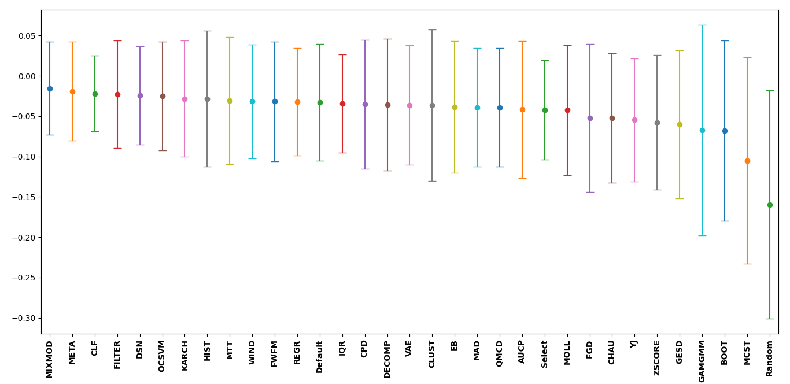
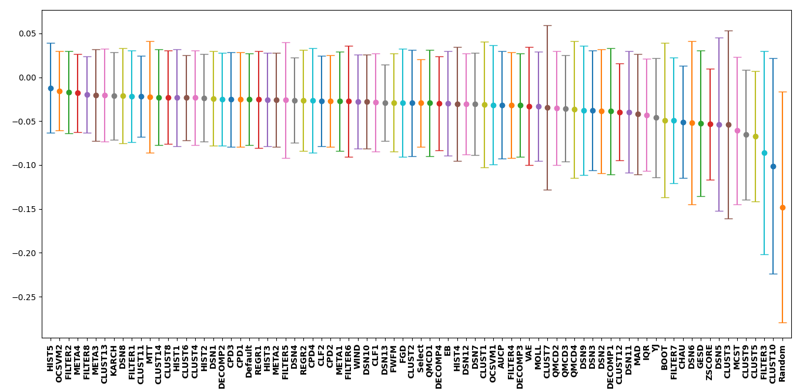
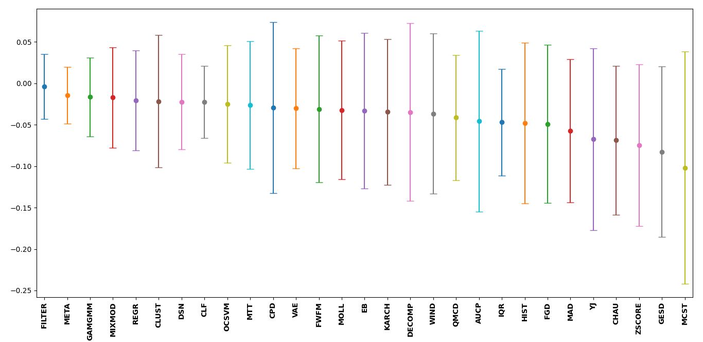
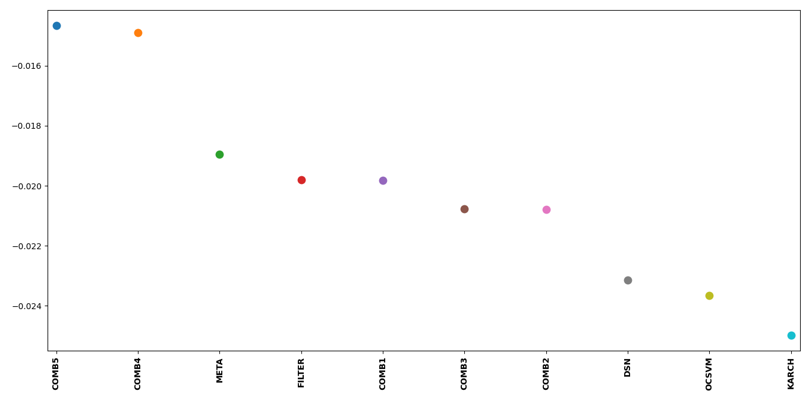
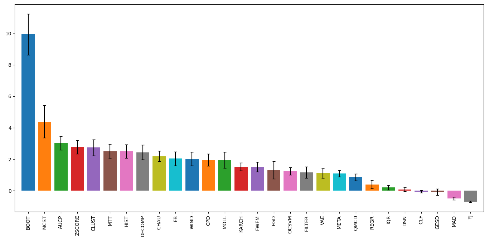
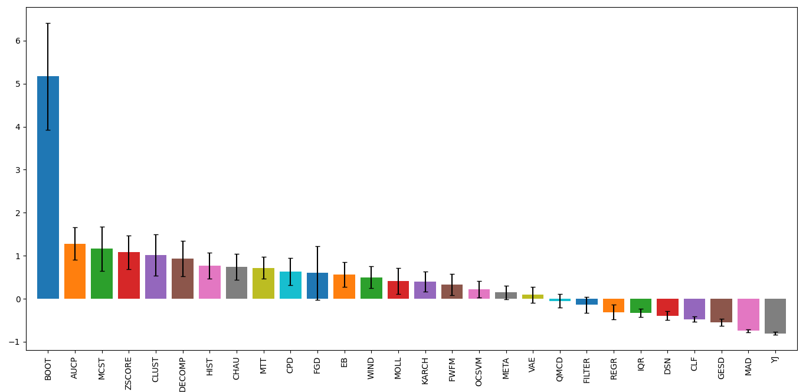
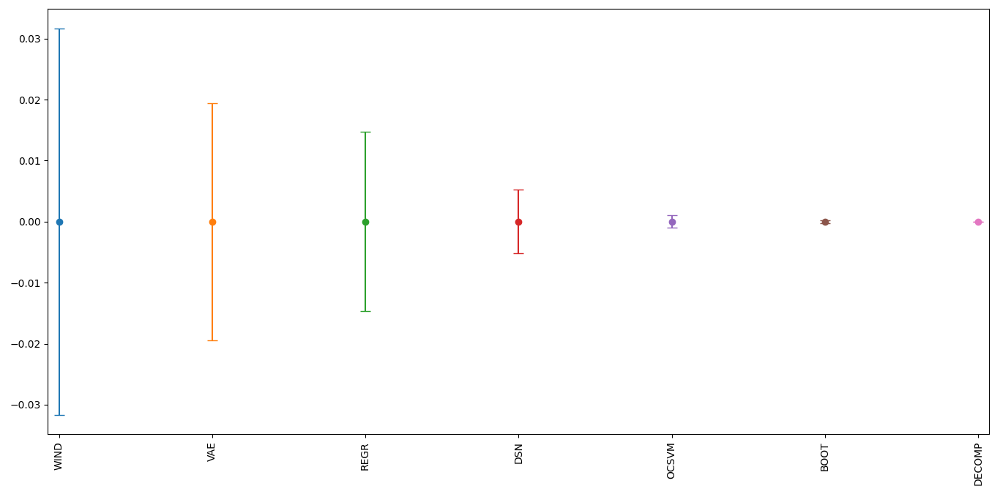

############
 Benchmarks
############

**************
 Introduction
**************

Selecting the correct outlier detection and thresholding method can be a
difficult task. Especially with all the different methods available in
both stages. Quantifying how well each method performs over a variety of
datasets may help when selecting based on either accuracy or robustness
or both. PyOD provides a highly detailed analysis on the performance of
all the available methods, with great insight and interpretability
`anomaly detection benchmark paper
<https://proceedings.neurips.cc/paper_files/paper/2022/hash/cf93972b116ca5268827d575f2cc226b-Abstract-Datasets_and_Benchmarks.html>`_.

Since the thresholding methods are dependant on both the dataset and the
outlier detection likelihood scores, in order to quantify how well a
threshold method works, it must be tested against multiple datasets
applying multiple outlier detection methods to each dataset. All the
benchmark datasets can be found at `ODDS
<http://odds.cs.stonybrook.edu/#table1>`_.

----

To quantify how well the threshold method is able to correctly set
inlier/outlier labels for a dataset, a well-defined metric must be used.
The Matthews correlation coefficient (MCC) will be used as it provides a
balanced measure when assessing class labels from a binary setup for an
imbalanced dataset. This coefficient is given as,

.. math::

   MCC = \frac{TP \cdot TN - FP \cdot FN}{\sqrt{(TP + FP) \cdot (TP + FN) \cdot (TN + FP) \cdot (TN + FN)}} \mathrm{,}

where :math:`TP, TN, FP, FN` represent the true positive, true negative,
false positive, and the false negative respectively. The MCC ranges from
-1 to 1 where 1 represents a perfect prediction, 0 an average random
prediction, and -1 an inverse prediction. This metric performs
particularly well at providing a balanced score and penalizing
thresholding methods that tend to over predict the best contamination
level (most :math:`TP` and :math:`TN` and least :math:`FP` and
:math:`FN`) based on the selected outlier detection likelihood scores
unlike the F1 score which focuses only on outliers. However, if finding
and removing all the outliers regardless of how many inliers also get
removed the F1 score is a better metric.

Since the thresholding method is heavily dependant on the outlier
detection likelihood scores, and therefore the selected outlier
detection method, simply calculating the MCC for each dataset would
yield varying results that would have more dependance on the selected
outlier method than the thresholding method. To correctly evaluate and
eliminate the effects of the selected outlier detection method, the MCC
deterioration will be used. This deterioration score is the difference
between the MCC of the thresholded labels and the MCC for the labels
produced by setting the true contamination level for the selected
outlier detection method (e.g. KNN(contamination=true_contam)).

For consistency, the benchmark results below used the unit-normalized
MCC, which is given by,

.. math::

   MCC_{\rm{norm}} = \frac{MCC + 1}{2} \mathrm{.}

**************
 Benchmarking
**************

All the thresholders using default parameters were tested on the
``arrhythmia, cardio, glass, ionosphere, letter, lympho, mnist, musk,
optdigits, pendigits, pima, satellite, satimage-2, vertebral, vowels,``
and ``wbc`` datasets using the ``PCA, MCD, KNN, IForest, GMM,`` and
``COPOD`` outlier methods on each dataset. The MCC deterioration was
calculated for each instance and the mean and standard deviation of all
the scores were calculated.

To interpret the plot below, the best to worst performing thresholders
have been plotted from left to right with their respective uncertainty.
The closer the mean value is to zero, the closer the thresholder
performed with regards to the MCC for the labels produced by setting the
true contamination level for the selected outlier detection method.
However, the uncertainty for many goes beyond zero indicating that in
some instances the thresholder performed better than setting true
contamination level for a particular dataset and outlier detection
method. Along with the thresholders, the default contamination level set
for each outlier detection method (`Default`) = 10% was tested as well
as randomly picking a contamination level between 1% - 20% (`Select`).
Finally, a baseline was also calculated if outliers were selected at
random (`Random`). This was done by setting :math:`MCC_{\rm{norm}} = 1`.

Overall, a significant amount of thresholders performed better than
selecting a random contamination level. The ``MIXMOD`` thresholder
performed best while the ``CLF`` thresholder provided the smallest
uncertainty about its mean and is the most robust (best least accurate
prediction). However, for interpretability and general performance the
``MIXMOD, FILTER,`` and ``META`` thresholders are good fits.

----

For a deeper look at the different user input parameters for each
thresholder, the benchmarking was repeated for the same outlier
detection methods as above. However, due to time constraints, only the
``arrhythmia, cardio, glass, ionosphere, letter, lympho, pima,
vertebral, vowels,`` and ``wbc`` datasets were used. The table below
indicates the x-axis labels seen in the plot and the thresholding method
that it corresponds to. It can be noticed that the best performing
thresholder differs from the first plot. This is due to a smaller
dataset with fewer examples and a greater bias.

+---------------+---------------------------------------+
| Label         | Method                                |
+===============+=======================================+
| AUCP          | AUCP()                                |
+---------------+---------------------------------------+
| BOOT          | BOOT()                                |
+---------------+---------------------------------------+
| CHAU          | CHAU()                                |
+---------------+---------------------------------------+
| CLF1          | CLF(method='simple')                  |
+---------------+---------------------------------------+
| CLF2          | CLF(method='complex')                 |
+---------------+---------------------------------------+
| CLUST1        | CLUST(method='agg')                   |
+---------------+---------------------------------------+
| CLUST2        | CLUST(method='birch')                 |
+---------------+---------------------------------------+
| CLUST3        | CLUST(method='bang')                  |
+---------------+---------------------------------------+
| CLUST4        | CLUST(method='bgm')                   |
+---------------+---------------------------------------+
| CLUST5        | CLUST(method='bsas')                  |
+---------------+---------------------------------------+
| CLUST6        | CLUST(method='dbscan')                |
+---------------+---------------------------------------+
| CLUST7        | CLUST(method='ema')                   |
+---------------+---------------------------------------+
| CLUST8        | CLUST(method='kmeans')                |
+---------------+---------------------------------------+
| CLUST9        | CLUST(method='mbsas')                 |
+---------------+---------------------------------------+
| CLUST10       | CLUST(method='mshift')                |
+---------------+---------------------------------------+
| CLUST11       | CLUST(method='optics')                |
+---------------+---------------------------------------+
| CLUST12       | CLUST(method='somsc')                 |
+---------------+---------------------------------------+
| CLUST13       | CLUST(method='spec')                  |
+---------------+---------------------------------------+
| CLUST14       | CLUST(method='xmeans')                |
+---------------+---------------------------------------+
| CPD1          | CPD(method='Dynp')                    |
+---------------+---------------------------------------+
| CPD2          | CPD(method='KernelCPD')               |
+---------------+---------------------------------------+
| CPD3          | CPD(method='Binseg')                  |
+---------------+---------------------------------------+
| CPD4          | CPD(method='BottomUp')                |
+---------------+---------------------------------------+
| DECOMP1       | DECOMP(method='NMF')                  |
+---------------+---------------------------------------+
| DECOMP2       | DECOMP(method='PCA')                  |
+---------------+---------------------------------------+
| DECOMP3       | DECOMP(method='GRP')                  |
+---------------+---------------------------------------+
| DECOMP4       | DECOMP(method='SRP')                  |
+---------------+---------------------------------------+
| DSN1          | DSN(metric='JS')                      |
+---------------+---------------------------------------+
| DSN2          | DSN(metric='WS')                      |
+---------------+---------------------------------------+
| DSN3          | DSN(metric='ENG')                     |
+---------------+---------------------------------------+
| DSN4          | DSN(metric='BHT')                     |
+---------------+---------------------------------------+
| DSN5          | DSN(metric='HLL')                     |
+---------------+---------------------------------------+
| DSN6          | DSN(metric='HI')                      |
+---------------+---------------------------------------+
| DSN7          | DSN(metric='LK')                      |
+---------------+---------------------------------------+
| DSN8          | DSN(metric='MAH')                     |
+---------------+---------------------------------------+
| DSN9          | DSN(metric='TMT')                     |
+---------------+---------------------------------------+
| DSN10         | DSN(metric='RES')                     |
+---------------+---------------------------------------+
| DSN11         | DSN(metric='KS')                      |
+---------------+---------------------------------------+
| DSN12         | DSN(metric='INT')                     |
+---------------+---------------------------------------+
| DSN13         | DSN(metric='MMD')                     |
+---------------+---------------------------------------+
| EB            | EB()                                  |
+---------------+---------------------------------------+
| FGD           | FGD()                                 |
+---------------+---------------------------------------+
| FILTER1       | FILTER(method='gaussian')             |
+---------------+---------------------------------------+
| FILTER2       | FILTER(method='savgol')               |
+---------------+---------------------------------------+
| FILTER3       | FILTER(method='hilbert')              |
+---------------+---------------------------------------+
| FILTER4       | FILTER(method='wiener')               |
+---------------+---------------------------------------+
| FILTER5       | FILTER(method='medfilt')              |
+---------------+---------------------------------------+
| FILTER6       | FILTER(method='decimate')             |
+---------------+---------------------------------------+
| FILTER7       | FILTER(method='detrend')              |
+---------------+---------------------------------------+
| FILTER8       | FILTER(method='resample')             |
+---------------+---------------------------------------+
| FWFM          | FWFM()                                |
+---------------+---------------------------------------+
| GESD          | GESD()                                |
+---------------+---------------------------------------+
| HIST1         | HIST(method='otsu')                   |
+---------------+---------------------------------------+
| HIST2         | HIST(method='yen')                    |
+---------------+---------------------------------------+
| HIST3         | HIST(method='isodata')                |
+---------------+---------------------------------------+
| HIST4         | HIST(method='li')                     |
+---------------+---------------------------------------+
| HIST5         | HIST(method='triangle')               |
+---------------+---------------------------------------+
| IQR           | IQR()                                 |
+---------------+---------------------------------------+
| KARCH         | KARCH()                               |
+---------------+---------------------------------------+
| MAD           | MAD()                                 |
+---------------+---------------------------------------+
| MCST          | MCST()                                |
+---------------+---------------------------------------+
| META1         | META(method='LIN')                    |
+---------------+---------------------------------------+
| META2         | META(method='GNB')                    |
+---------------+---------------------------------------+
| META3         | META(method='GNBC')                   |
+---------------+---------------------------------------+
| META4         | META(method='GNBM')                   |
+---------------+---------------------------------------+
| MOLL          | MOLL()                                |
+---------------+---------------------------------------+
| MTT           | MTT()                                 |
+---------------+---------------------------------------+
| OCSVM1        | OCSVM(model='poly')                   |
+---------------+---------------------------------------+
| OCSVM2        | OCSVM(model='sgd')                    |
+---------------+---------------------------------------+
| QMCD1         | QMCD(method='CD')                     |
+---------------+---------------------------------------+
| QMCD2         | QMCD(method='WD')                     |
+---------------+---------------------------------------+
| QMCD3         | QMCD(method='MD')                     |
+---------------+---------------------------------------+
| QMCD4         | QMCD(method='L2-star')                |
+---------------+---------------------------------------+
| REGR1         | REGR(method='siegel')                 |
+---------------+---------------------------------------+
| REGR2         | REGR(method='theil')                  |
+---------------+---------------------------------------+
| VAE           | VAE()                                 |
+---------------+---------------------------------------+
| WIND          | WIND()                                |
+---------------+---------------------------------------+
| YJ            | YJ()                                  |
+---------------+---------------------------------------+
| ZSCORE        | ZSCORE()                              |
+---------------+---------------------------------------+

----

Multiple outlier detection likelihood score sets as of ``PyThresh``
version 0.3.3 can now also be thresholded. This functionality is
achieved by decomposing the score set using 1D TruncatedSVD
decomposition. This allows the decomposed scores to capture a more
robust outlier likelihood score set. To benchmark these scores, a
similar setup is followed as the first benchmark test, however, the
labels were set using the true contamination applied to the decomposed
scores as the right-hand component of the MCC deterioration equation.

However, to effectively compare whether the multiple outlier detection
likelihood score set performed better than using a single outlier
likelihood score set they must both be benchmarked against the same
comparison. This can be done by setting the right-hand component of the
MCC deterioration to the true labels such that the right-hand component
is equal to 1. Below is a vertical dumbbell comparison plot between
using single or multiple outlier likelihood score sets for thresholding.
Above each comparison a performance percentage indicates how much better
or worse multiple scores performed to using single score thresholding.
From this, it can be shown that by using a multiple outlier likelihood
score set it generally performs better than using a single outlier
likelihood scores set.

----

***********************
 External Benchmarking
***********************

An external benchmark test of all the default thresholders is available
in `Estimating the Contamination Factor's Distribution in Unsupervised
Anomaly Detection <https://arxiv.org/abs/2210.10487>`_. However it is
important to note that a different evaluation metric was used (F1
deterioration), and also since the publishing of this article some
default parameters for some thresholders have been changed. Still, this
article provides a thorough analysis of the performance of the
thresholders in ``PyThresh`` with many insightful results and detailed
analysis of thresholding outlier decision likelihood scores.

----

*************************
 Thresholder Combination
*************************

The ``COMB`` thresholder allows for combining the output from several
thresholders to produce an amalgamated result. However, there are
several methods with which to combine thresholders. Each method's
ability to calculate a well-rounded general result from its constituents
is important for increased accuracy and overall performance.

To evaluate the performance of each method available from the ``COMB``
thresholder the same outlier detection methods as well as datasets from
the first benchmarking test were applied. The selected thresholders that
were combined were ``META``, ``FILTER``, ``DSN``, ``OCSVM``, and
``KARCH`` all using default parameters. It was found that the ``bagged``
and ``stacked`` methods performed significantly better than any
individual input thresholder while the ``mean``, ``median``, ``mode``
methods produced results that were comparable to their inputs.

+---------------+---------------------------------------+
| Label         | Method                                |
+===============+=======================================+
| COMB1         | COMB(method='mean')                   |
+---------------+---------------------------------------+
| COMB2         | COMB(method='median')                 |
+---------------+---------------------------------------+
| COMB3         | COMB(method='mode')                   |
+---------------+---------------------------------------+
| COMB4         | COMB(method='bagged')                 |
+---------------+---------------------------------------+
| COMB5         | COMB(method='stacked')                |
+---------------+---------------------------------------+

----

*****************
 Over Prediction
*****************

All thresholders have a tendency to over predict the contamination level
of the outlier scores. This will lead to not only mis-classifying
inliers based on the outlier detection method's capabilities but also
additional inliers which will lead to a loss of significant data with
which to work with. Therefore it is important to note which thresholders
have the highest potential to over predict.

To evaluate the over predictive nature of each thresholder, the ratio
between the predicted and true contamination level will be used. The
mean of the ratios minus one is calculated for each thresholder using
the same setup as the first benchmark test. For this evaluation, a value
of 0 indicates perfect contamination predictions, below 0 is under
prediction, and above 0 is over prediction. ``BOOT`` has the highest
potential to over predict while most thresholders in general tend to
over predict. It is also important to note that a thresholder's
potential to over predict will vary significantly based on the selected
dataset and outlier detection method, and therefore it is important to
check the predicted contamination level after thresholding.

A second over predictive evaluation can also be done, but now with
regards to over predicting beyond the best contamination level for each
outlier detection method on each dataset based on the MCC score. As seen
below, a significant amount of thresholders still tend to over predict
even beyond the best contamination level. However, now some clear well
performing thresholders can be matched to the previous benchmarking,
notably ``META`` and ``FILTER``.

----

***********************
 Effects of Randomness
***********************

Some thresholders use randomness in their methods and the random seed
can be set using the parameter ``random_state``. To investigate the
effect of randomness on the resulting labels the MCC deterioration was
calculated for each thresholder using the random states (1234, 42, 9685,
and 111222). The same outlier detection methods as well as datasets from
the first benchmarking test were applied. The means of the MCC
deterioration were normalized to zero showing the extent of the effect
of randomness of each thresholder's ability to evaluate labels for the
outlier decision likelihood scores indicated in the uncertainty.

From the plot below, ``WIND`` performed the worst and was highly
affected by the choice of the selected random state. ``DSN`` which is a
thresholder that overall performed well during the benchmark tests is
also sensitive to randomness. To alleviate the effects of randomness on
the thresholders, it is recommended that a combined method be used by
setting different random states (e.g. ``COMB(thresholders =
[DSN(random_state=1234), DSN(random_state=42), DSN(random_state=9685),
DSN(random_state=111222)])``). This should provide a more robust and
reliable result.

----

*****************
 Time Complexity
*****************

Working with big data can mean time constraints with regards to
thresholding. Therefore, time complexity may need to be considered when
selecting the correct thresholder to use. This time complexity can be
quantified by using the Big-O notation metric. This metric demonstrates
how many seconds it takes to compute the number of outlier likelihood
scores (n). From the benchmark table below, it can be seen that most
thresholders have a quadratic time complexity of around ~1e-8*n^2. This
is due to most thresholders using kernel density estimations within
their methods. This time complexity equates about 0.01s for 1000
datapoints, 1s for 10000 datapoints, 100s for 100000 datapoints, and
about 2.5 hours for 1 million datapoints. If time is a factor, suggested
thresholders with reasonable accuracy are: FILTER with 10s, OCSVM with
0.1s, and MTT with 100s for one million datapoints. **Note** that these
benchmarks were done using an i5 12th gen processor and results may
scale slightly differently depending on the hardware used.

+---------------+--------------------+------------------------+
| Method        | Complexity         | Big-O Notation         |
+===============+====================+========================+
| AUCP          | Quadratic          | ~1e-8*n^2              |
+---------------+--------------------+------------------------+
| BOOT          | Quadratic          | ~1e-8*n^2              |
+---------------+--------------------+------------------------+
| CHAU          | Linear             | ~1e-8*n                |
+---------------+--------------------+------------------------+
| CLF           | Quadratic          | ~1e-8*n^2              |
+---------------+--------------------+------------------------+
| CLUST         | Quadratic          | ~1e-8*n^2              |
+---------------+--------------------+------------------------+
| CPD           | Quadratic          | ~1e-8*n^2              |
+---------------+--------------------+------------------------+
| DECOMP        | Quadratic          | ~1e-8*n^2              |
+---------------+--------------------+------------------------+
| DSN           | Quadratic          | ~1e-8*n^2              |
+---------------+--------------------+------------------------+
| EB            | Linearithmic       | ~1-06*n*log(n)         |
+---------------+--------------------+------------------------+
| FGD           | Quadratic          | ~1e-8*n^2              |
+---------------+--------------------+------------------------+
| FILTER        | Quadratic          | ~1e-11*n^2             |
+---------------+--------------------+------------------------+
| FWFM          | Quadratic          | ~1e-8*n^2              |
+---------------+--------------------+------------------------+
| GAMGMM        | Quadratic          | ~1e-6*n^2              |
+---------------+--------------------+------------------------+
| GESD          | Quadratic          | ~1e-9*n^2              |
+---------------+--------------------+------------------------+
| HIST          | Linear             | ~1e-8*n                |
+---------------+--------------------+------------------------+
| IQR           | Linear             | ~1e-8*n                |
+---------------+--------------------+------------------------+
| KARCH         | Quadratic          | ~1e-8*n^2              |
+---------------+--------------------+------------------------+
| MAD           | Linear             | ~1e-8*n                |
+---------------+--------------------+------------------------+
| MCST          | Quadratic          | ~1e-7*n^2              |
+---------------+--------------------+------------------------+
| META          | Cubic              | ~1e-12*n^3             |
+---------------+--------------------+------------------------+
| MIXMOD        | Linear             | ~1e-4*n                |
+---------------+--------------------+------------------------+
| MOLL          | Quadratic          | ~1e-10*n^2             |
+---------------+--------------------+------------------------+
| MTT           | Quadratic          | ~1e-10*n^2             |
+---------------+--------------------+------------------------+
| OCSVM         | Linear             | ~1e-7*n                |
+---------------+--------------------+------------------------+
| QMCD          | Quadratic          | ~1e-9*n^2              |
+---------------+--------------------+------------------------+
| REGR          | Quadratic          | ~1e-8*n^2              |
+---------------+--------------------+------------------------+
| VAE           | Linear             | ~1e-3*n                |
+---------------+--------------------+------------------------+
| WIND          | Quadratic          | ~1e-8*n^2              |
+---------------+--------------------+------------------------+
| YJ            | Quadratic          | ~1e-8*n^2              |
+---------------+--------------------+------------------------+
| ZSCORE        | Linear             | ~1e-8*n                |
+---------------+--------------------+------------------------+
