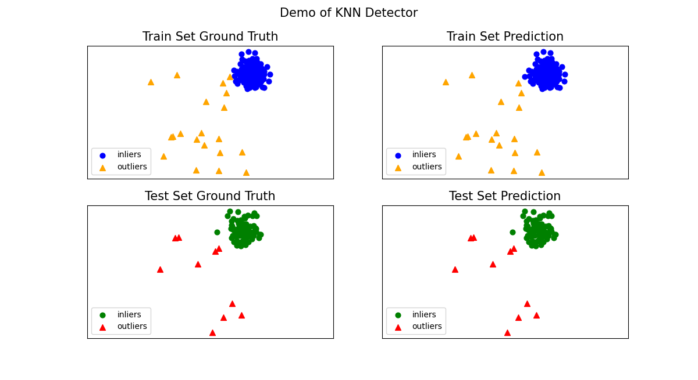

Examples
========

Featured Tutorials
------------------

PyThresh has a variety of different thresholding methods and an online example can be found at.

**Towards Data Science**: `Thresholding Outlier Detection Scores with PyThresh  <https://towardsdatascience.com/thresholding-outlier-detection-scores-with-pythresh-f26299d14fa>`_

----

Karcher Mean Example
--------------------

Full example: `karch_example.py <https://github.com/KulikDM/pythresh/blob/main/examples/karch_example.py>`_

1. Import models

    .. code-block:: python

        from pyod.models.knn import KNN
        from pyod.utils.data import generate_data

        from pyod.utils.data import evaluate_print
        from pyod.utils.example import visualize

        from pythresh.thresholds.karch import KARCH

2. Generate sample data with :func:`pyod.utils.data.generate_data`:

    .. code-block:: python

        contamination = 0.1  # percentage of outliers
        n_train = 200  # number of training points
        n_test = 100  # number of testing points

        X_train, X_test, y_train, y_test = \
        generate_data(n_train=n_train,
                      n_test=n_test,
                      n_features=2,
                      contamination=contamination,
                      random_state=42)

3. Initialize a :class:`pyod.models.knn.KNN` detector, fit the model, and threshold
the outlier detection scores.

    .. code-block:: python

        # train kNN detector
        clf_name = 'KNN'
        clf = KNN()
        clf.fit(X_train)
        thres = KARCH()

        # get the prediction labels and outlier scores of the training data
        y_train_scores = clf.decision_scores_  # raw outlier scores
        y_train_pred = thres.eval(y_train_scores)  # binary labels (0: inliers, 1: outliers)

        # get the prediction on the test data
        y_test_scores = clf.decision_function(X_test)  # outlier scores
        y_test_pred = thres.eval(y_test_scores)  # outlier labels (0 or 1)

        # it is possible to get the prediction confidence as well
        y_test_pred, y_test_pred_confidence = clf.predict(X_test, return_confidence=True)  # outlier labels (0 or 1) and confidence in the range of [0,1]

4. Evaluate the prediction using ROC and Precision @ Rank n :func:`pyod.utils.data.evaluate_print`.

    .. code-block:: python

        from pyod.utils.data import evaluate_print
        # evaluate and print the results
        print("\nOn Training Data:")
        evaluate_print(clf_name, y_train, y_train_scores)
        print("\nOn Test Data:")
        evaluate_print(clf_name, y_test, y_test_scores)

5. See sample outputs on both training and test data.

    .. code-block:: bash

        On Training Data:
        KNN ROC:0.9992, precision @ rank n:0.95

        On Test Data:
        KNN ROC:1.0, precision @ rank n:1.0

6. Generate the visualizations by visualize function included in all examples.

    .. code-block:: python

        visualize(clf_name, X_train, X_test, y_train, y_test, y_train_pred,
                  y_test_pred, show_figure=True, save_figure=False)

----

Model Combination Example
-------------------------

Just as outlier detection often suffers from model instability, a thresholding
method may as well due to its unsupervised nature. Thus, it is recommended to combine
various thresholders outputs, e.g., by averaging, to improve its robustness.
Luckily this has already been written for covenience as the function
"pythresh.thresholds.all"

----

Additional API Example
----------------------

1. Get the normalized threshold value that seperates the inliers from outliers after the
scores have been evaluated. Note, the outlier detection scores are normalized between 0 and 1.

    .. code-block:: python

        # train kNN detector
        clf_name = 'KNN'
        clf = KNN()
        clf.fit(X_train)

        scores = clf.decision_function(X_train)
        thres = OCSVM()
        labels = thres.eval(scores)

        threshold = thres.thresh_

2. Similarly, the lower and upper confidence interval of the contamination level for the
:class:`pythresh.thresholds.all.ALL` thresholder can be retrieved.

    .. code-block:: python

        # train kNN detector
        clf_name = 'KNN'
        clf = KNN()
        clf.fit(X_train)

        scores = clf.decision_function(X_train)
        thres = ALL()
        labels = thres.eval(scores)

        conf_interval = thres.confidence_interval_

For Jupyter Notebooks, please navigate to `notebooks <https://github.com/KulikDM/pythresh/tree/main/notebooks>`_
for additional use case references

.. rubric:: References

.. bibliography::
   :cited:
   :labelprefix: B
   :keyprefix: b-
