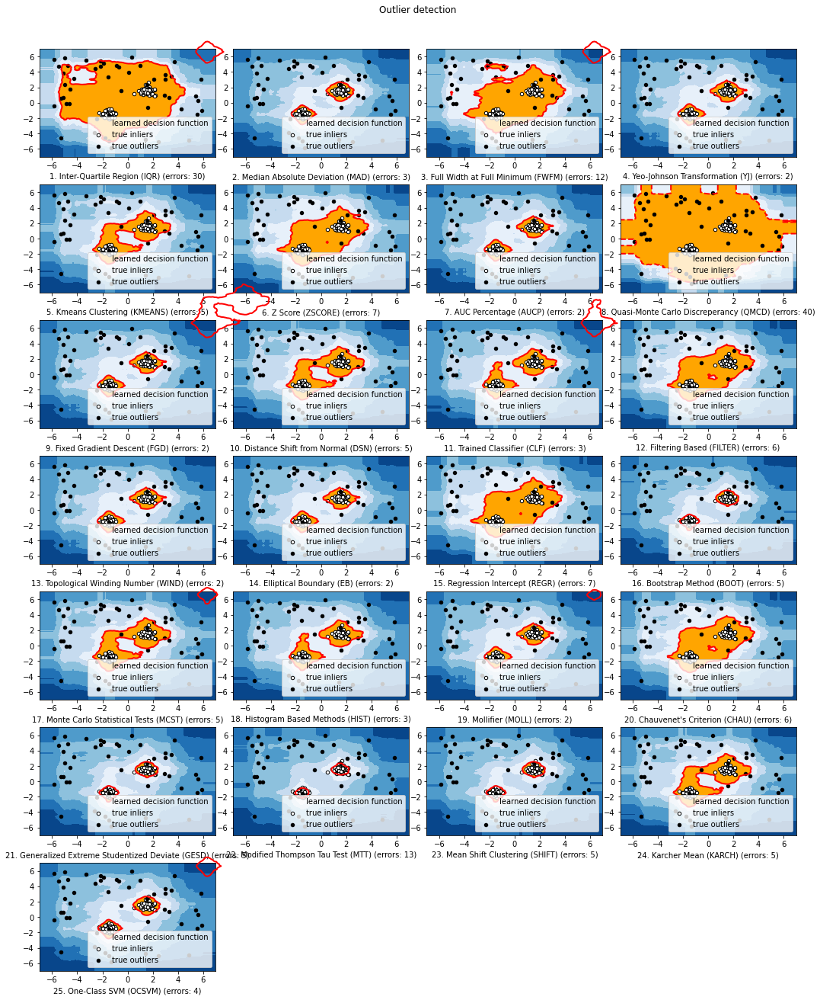

###################################
 Welcome to PyThresh Documentation
###################################

**Deployment, Stats, & License**

.. image:: https://img.shields.io/pypi/v/pythresh.svg?color=brightgreen&logo=pypi&logoColor=white
   :target: https://pypi.org/project/pythresh/
   :alt: PyPI version

.. image:: https://img.shields.io/conda/vn/conda-forge/pythresh?color=brightgreen&logo=conda-forge&logoColor=white
   :target: https://anaconda.org/conda-forge/pythresh
   :alt: Anaconda version

.. image:: https://img.shields.io/readthedocs/pythresh.svg?version=latest&logo=read-the-docs&logoColor=white
   :target: http://pythresh.readthedocs.io/?badge=latest
   :alt: Documentation status

.. image:: https://github.com/KulikDM/pythresh/actions/workflows/python-package.yml/badge.svg
   :target: https://github.com/KulikDM/pythresh/actions/workflows/python-package.yml
   :alt: testing

.. image:: https://codecov.io/gh/KulikDM/pythresh/branch/main/graph/badge.svg?token=8ZAPXTLW9Y
   :target: https://codecov.io/gh/KulikDM/pythresh
   :alt: Codecov

.. image:: https://api.codeclimate.com/v1/badges/3e2de42b48701c731ef6/maintainability
   :target: https://codeclimate.com/github/KulikDM/pythresh/maintainability
   :alt: Maintainability

.. image:: https://img.shields.io/github/stars/KulikDM/pythresh.svg?logo=github&logoColor=white
   :target: https://github.com/KulikDM/pythresh/stargazers
   :alt: GitHub stars

.. image:: https://pepy.tech/badge/pythresh?
   :target: https://pepy.tech/project/pythresh
   :alt: Downloads

.. image:: https://img.shields.io/pypi/pyversions/pythresh.svg?logo=python&logoColor=white
   :target: https://pypi.org/project/pythresh/
   :alt: Python versions

.. image:: https://img.shields.io/github/license/KulikDM/pythresh.svg
   :target: https://github.com/KulikDM/pythresh/blob/master/LICENSE
   :alt: License

.. image:: https://zenodo.org/badge/497683169.svg
   :target: https://zenodo.org/badge/latestdoi/497683169
   :alt: Zenodo DOI

----

PyThresh is a comprehensive and scalable **Python toolkit** for
**thresholding outlier detection scores** in univariate/multivariate
data. It has been writen to work in tandem with PyOD and has similar
syntax and data structures. However, it is not limited to this single
library. PyThresh is meant to threshold scores generated by an outlier
detection. It thresholds scores without the need to set a contamination
level or have the user guess the amount of outliers that may exist in
the dataset beforehand. These non-parametric methods were written to
reduce the user's input/guess work and rather rely on statistics instead
to threshold outlier scores. For thresholding to be applied correctly,
the outlier detection scores must follow this rule: the higher the
score, the higher the probability that it is an outlier in the dataset.
All threshold functions return a binary array where inliers and outliers
are represented by a 0 and 1 respectively.

PyThresh includes more than 30 thresholding algorithms. These algorithms
range from using simple statistical analysis like the Z-score to more
complex mathematical methods that involve graph theory and topology.

**API Demo**:

.. code:: python

   # train the KNN detector
   from pyod.models.knn import KNN
   from pythresh.thresholds.clust import CLUST

   clf = KNN()
   clf.fit(X_train)

   # get outlier scores
   decision_scores = clf.decision_scores_  # raw outlier scores on the train data

   # get outlier labels
   thres = CLUST()
   labels = thres.eval(decision_scores)

----

**************
 Benchmarking
**************

Benchmarking has been done on all the thresholders and it was found
that the ``META`` thresholder performed best while the ``CLF`` thresholder
provided the smallest uncertainty about its mean and is the most robust
(best least accurate prediction). However, for interpretability and
general performance the ``FILTER`` thresholder is a good fit.

----

************************
 External Feature Cases
************************

**Towards Data Science**: `Thresholding Outlier Detection Scores with
PyThresh
<https://towardsdatascience.com/thresholding-outlier-detection-scores-with-pythresh-f26299d14fa>`_

**Towards Data Science**: `When Outliers are Significant: Weighted
Linear Regression
<https://towardsdatascience.com/when-outliers-are-significant-weighted-linear-regression-bcdc8389ab10>`_

**ArXiv**: `Estimating the Contamination Factor's Distribution in
Unsupervised Anomaly Detection <https://arxiv.org/abs/2210.10487>`_

----

***********************************
 Available Thresholding Algorithms
***********************************

+-----------+----------------------------------------------------------------+-----------------------------------+
| Abbr      | Description                                                    | References                        |
+===========+================================================================+===================================+
| AUCP      | Area Under Curve Percentage                                    | :cite:`ren2018aucp`               |
+-----------+----------------------------------------------------------------+-----------------------------------+
| BOOT      | Bootstrapping                                                  | :cite:`martin2006boot`            |
+-----------+----------------------------------------------------------------+-----------------------------------+
| CHAU      | Chauvenet's Criterion                                          | :cite:`bolshev2016chau`           |
+-----------+----------------------------------------------------------------+-----------------------------------+
| CLF       | Trained Linear Classifier                                      | :cite:`aggarwal2017clf`           |
+-----------+----------------------------------------------------------------+-----------------------------------+
| CLUST     | Clustering Based                                               | :cite:`klawonn2008clust`          |
+-----------+----------------------------------------------------------------+-----------------------------------+
| CPD       | Change Point Detection                                         | :cite:`fearnhead2016cpd`          |
+-----------+----------------------------------------------------------------+-----------------------------------+
| DECOMP    | Decomposition                                                  | :cite:`boente2002decomp`          |
+-----------+----------------------------------------------------------------+-----------------------------------+
| DSN       | Distance Shift from Normal                                     | :cite:`amagata2021dsn`            |
+-----------+----------------------------------------------------------------+-----------------------------------+
| EB        | Elliptical Boundary                                            | :cite:`friendly2013eb`            |
+-----------+----------------------------------------------------------------+-----------------------------------+
| FGD       | Fixed Gradient Descent                                         | :cite:`qi2021fgd`                 |
+-----------+----------------------------------------------------------------+-----------------------------------+
| FILTER    | Filtering Based                                                | :cite:`hashemi2019filter`         |
+-----------+----------------------------------------------------------------+-----------------------------------+
| FWFM      | Full Width at Full Minimum                                     | :cite:`joneidi2013fwfm`           |
+-----------+----------------------------------------------------------------+-----------------------------------+
| GESD      | Generalized Extreme Studentized Deviate                        | :cite:`alrawashdeh2021gesd`       |
+-----------+----------------------------------------------------------------+-----------------------------------+
| HIST      | Histogram Based                                                | :cite:`thanammal2015hist`         |
+-----------+----------------------------------------------------------------+-----------------------------------+
| IQR       | Inter-Quartile Regression                                      | :cite:`bardet2015iqr`             |
+-----------+----------------------------------------------------------------+-----------------------------------+
| KARCH     | Karcher mean (Riemannian Center of Mass)                       | :cite:`afsari2011karch`           |
+-----------+----------------------------------------------------------------+-----------------------------------+
| MAD       | Median Absolute Deviation                                      | :cite:`archana2015mad`            |
+-----------+----------------------------------------------------------------+-----------------------------------+
| MCST      | Monte Carlo Shapiro Tests                                      | :cite:`coin2008mcst`              |
+-----------+----------------------------------------------------------------+-----------------------------------+
| META      | Metamodel Trained Classifier                                   | :cite:`zhao2022meta`              |
+-----------+----------------------------------------------------------------+-----------------------------------+
| MOLL      | Friedrichs' Mollifier                                          | :cite:`keyzer1997moll`            |
+-----------+----------------------------------------------------------------+-----------------------------------+
| MTT       | Modified Thompson Tau Test                                     | :cite:`rengasamy2020mtt`          |
+-----------+----------------------------------------------------------------+-----------------------------------+
| OCSVM     | One-Class Support Vector Machine                               | :cite:`barbado2022ocsvm`          |
+-----------+----------------------------------------------------------------+-----------------------------------+
| QMCD      | Quasi-Monte Carlo Discrepancy                                  | :cite:`iouchtchenko2019qmcd`      |
+-----------+----------------------------------------------------------------+-----------------------------------+
| REGR      | Regression Based                                               | :cite:`aggarwal2017clf`           |
+-----------+----------------------------------------------------------------+-----------------------------------+
| VAE       | Variational Autoencoder                                        | :cite:`xiao2020vae`               |
+-----------+----------------------------------------------------------------+-----------------------------------+
| WIND      | Topological Winding Number                                     | :cite:`jacobson2013wind`          |
+-----------+----------------------------------------------------------------+-----------------------------------+
| YJ        | Yeo-Johnson Transformation                                     | :cite:`raymaekers2021yj`          |
+-----------+----------------------------------------------------------------+-----------------------------------+
| ZSCORE    | Z-score                                                        | :cite:`bagdonavicius2020zscore`   |
+-----------+----------------------------------------------------------------+-----------------------------------+
| COMB      | Thresholder Combination                                        |                                   |
+-----------+----------------------------------------------------------------+-----------------------------------+

**The comparison among of implemented models** is made available below
(`Figure
<https://raw.githubusercontent.com/KulikDM/pythresh/main/imgs/All.png>`_\).
For Jupyter Notebooks, please navigate to **"/notebooks/Compare All
Thesholders.ipynb"**.

############################
 API Cheatsheet & Reference
############################

The following APIs are applicable for all detector models for easy use.

-  :func:`pythresh.thresholders.base.BaseDetector.eval`: evaluate
   outlier score.

Key Attributes of a threshold:

-  :attr:`pythresh.thresholders.base.BaseDetector.thresh_`: Return the
   threshold value that separates inliers from outliers. Outliers are
   considered all values above this threshold value. Note the threshold
   value has been derived from normalized scores.

----

.. toctree::
   :maxdepth: 2
   :hidden:
   :caption: Getting Started

   install
   example
   benchmark

.. toctree::
   :maxdepth: 2
   :hidden:
   :caption: Documentation

   api_cc
   pythresh

.. toctree::
   :maxdepth: 2
   :hidden:
   :caption: Additional Information

   FAQ

----

.. rubric:: References

.. bibliography::
   :cited:
   :labelprefix:
   :keyprefix: a-
