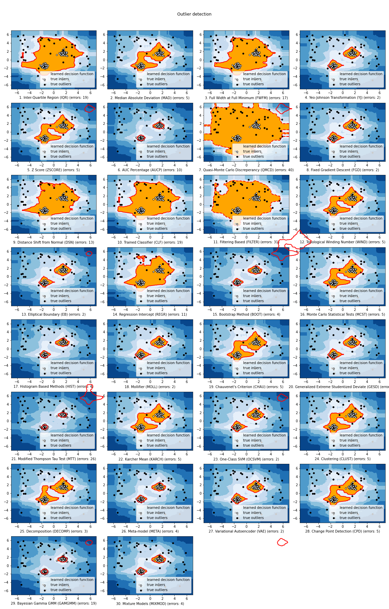

.. pyod documentation master file, created by
   sphinx-quickstart on Sun May 27 10:56:38 2018.
   You can adapt this file completely to your liking, but it should at least
   contain the root `toctree` directive.

Welcome to PyThresh Documentation
=================================

**Deployment, Stats, & License**

.. image:: https://img.shields.io/pypi/v/pythresh.svg?color=brightgreen&logo=pypi&logoColor=white
   :target: https://pypi.org/project/pythresh/
   :alt: PyPI version

.. image:: https://img.shields.io/github/stars/KulikDM/pythresh.svg?logo=github&logoColor=white
   :target: https://github.com/KulikDM/pythresh/stargazers
   :alt: GitHub stars

.. image:: https://img.shields.io/github/forks/KulikDM/pythresh.svg?color=blue&logo=github&logoColor=white
   :target: https://github.com/KulikDM/pythresh/network
   :alt: GitHub forks

.. image:: https://pepy.tech/badge/pythresh?
   :target: https://pepy.tech/project/pythresh
   :alt: Downloads
   
  
.. image:: https://img.shields.io/pypi/pyversions/pythresh.svg?logo=python&logoColor=white
   :target: https://pypi.org/project/pythresh/
   :alt: Python versions
  

.. image:: https://img.shields.io/github/license/KulikDM/pythresh.svg
   :target: https://github.com/KulikDM/pythresh/blob/master/LICENSE
   :alt: License

-----

PyThresh is a comprehensive and scalable **Python toolkit** for **thresholding outlier detection scores** in univariate/multivariate data. It has been writen to work in tandem with PyOD with similar syntax and data structures. However, it is not limited to this single library to achieve good results. PyThresh is meant to threshold scores generated by an outlier detection. It thresholds scores without the need to set a contamination level or have the user guess the amount of outliers that may exist in the dataset beforehand. These non-parametric methods were written to reduce the user's input/guess work and rely on statistics instead to threshold outlier scores. The scores needed to apply thresholing correctly must follow these rules: the higher the score, the higher the probability that it is an outlier in the dataset. All threshold functions return a binary array where 0 values represent inliers, while 1 values are outliers. 

PyThresh includes more than 30 thresholding algorithms. These algorithms range from using simple statistical analysis like the Z-score to more complex mathematical methods that involve graph theory and topology. 

**API Demo**\ :

.. code-block:: python

    # train the KNN detector
    from pyod.models.knn import KNN
    from pythresh.thresholds.dsn import DSN
    
    clf = KNN()
    clf.fit(X_train)

    # get outlier scores
    decision_scores = clf.decision_scores_  # raw outlier scores on the train data
    
    # get outlier labels 
    thres = DSN()
    labels = thres.eval(decision_scores)

----

Implemented Algorithms
^^^^^^^^^^^^^^^^^^^^^^

**(i) Individual Thresholding Algorithms** :

=========== ================================================================ ==============================================================================
Abbr        Description                                                      Parameters    
=========== ================================================================ ==============================================================================
AUCP        Area Under Curve Precentage [#aucp1]_            		           None
BOOT        Bootstrapping [#boot1]_            			                       None
CHAU		   Chauvenet's Criterion [#chau1]_     			                    method: [default='mean', 'median', 'gmean']
CLF		   Trained Classifier [#clf1]_        			                       None
DSN		   Distance Shift from Normal [#dsn1]_        		                 metric: [default = 'JS':  Jensen-Shannon, 'WS':  Wasserstein, 'ENG': Energy, 'BHT': Bhattacharyya, 'HLL': Hellinger, 'HI':  Histogram intersection, 'LK':  Lukaszyk–Karmowski metric for normal distributions, 'LP':  Levy-Prokhorov, 'MAH': Mahalanobis, 'TMT': Tanimoto, 'RES': Studentized residual distance, 'KS': Kolmogorov–Smirnov]
EB		      Elliptical Boundary [#eb1]_       			                       None
FGD		   Fixed Gradient Descent [#fgd1]_            		                 None
FILTER      Filtering Based [#filter1]_                                      method: ['gaussian', 'savgol', 'hilbert', default = 'wiener', 'medfilt', 'decimate', 'detrend', 'resample']; sigma: int, default='native'
FWFM		   Full Width at Full Minimum [#fwfm1]_        		                 None
GESD		   Generalized Extreme Studentized Deviate  [#gesd1]_               max_outliers: int, default='native'; alpha: float, default=0.05 
HIST		   Histogram Based [#hist1]_           			                    n_bins: int, default='native', method: [default='otsu', 'yen', 'isodata', 'li', 'minimum', 'triangle']
IQR		   Inter-Qaurtile Region [#iqr1]_		                             None
KARCH       Karcher mean (Riemannian Center of Mass) [#karch1]_              ndim: int, default = 2; method: ['simple', default = 'complex']
KMEANS		K-means Clustering [#kmeans1]_                     	           None
MAD		   Median Absolute Deviation [#mad1]_			                       None
MCST		   Monte Carlo Shapiro Tests	[#mcst1]_		                       None
MOLL		   Friedrichs' Mollifier [#moll1]_ [#moll2]_			                 None
MTT		   Modified Thompson Tau Test [#mtt1]_			                       strictness: [1,2,3,default=4,5]
QMCD        Quasi-Monte Carlo Discreprancy [#qmcd1]_		                    method: ['CD', default='WD', 'MD', 'L2-star'], lim: ['Q', default='P']
REGR		   Regression Based [#regr1]_      				                       method: [default='siegel', 'theil']
SHIFT		   Mean Shift Clustering [#shift1]_			       	                 None
WIND		   Topological Winding Number [#wind1]_    			                 None
YJ		      Yeo-Johnson Transformation [#yj1]_			                       None
ZSCORE		Z-score [#zscore1]_					                                None
ALL         All Thresholders Combined                                        thresholders: list, default='all'; max_contam: float, default=0.5; method: [default='mean', 'median', 'gmean']
=========== ================================================================ ==============================================================================

**The comparison among of implemented models** is made available below
(\ `Figure <https://raw.githubusercontent.com/KulikDM/pythresh/main/imgs/All.png>`_\).
For Jupyter Notebooks, please navigate to **"/notebooks/Compare All Thesholders.ipynb"**.

API Cheatsheet & Reference
==========================

The following APIs are applicable for all detector models for easy use. 

* :func:`pythresh.thresholders.base.BaseDetector.eval`: evaluate outlier score.

Key Attributes of a threshold:

* :attr:`pythresh.thresholders.base.BaseDetector.thres_`: Return the threshold value that seperates inliers from outliers. Outliers are considered all values above this threshold value. Note the threshold value has been derived from normalized scores.

----

.. toctree::
   :maxdepth: 2
   :hidden:
   :caption: Getting Started

   install
   example

.. toctree::
   :maxdepth: 2
   :hidden:
   :caption: Documentation

   api_cc
   pythresh

----

.. rubric:: References

.. bibliography::
   :cited:
   :labelprefix: A
   :keyprefix: a-