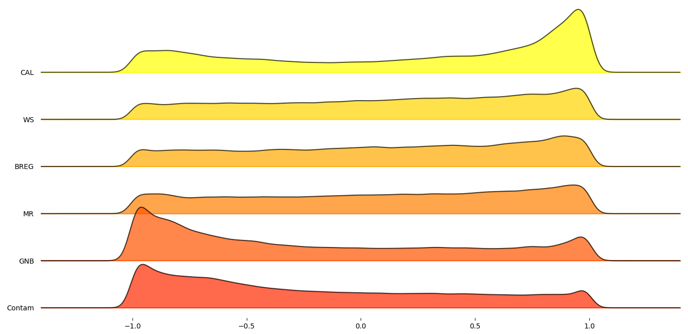
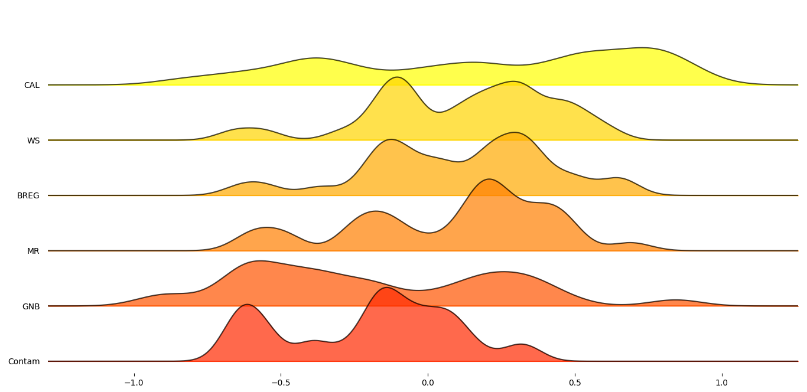
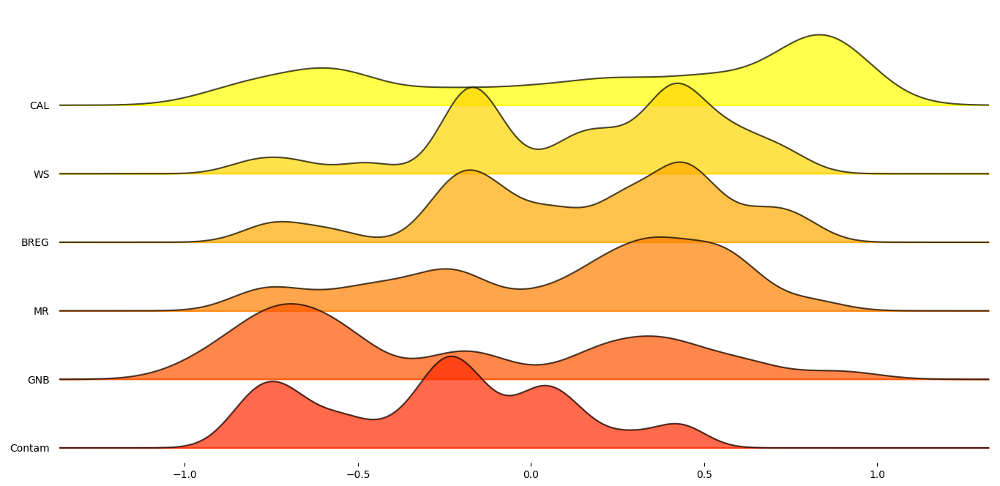
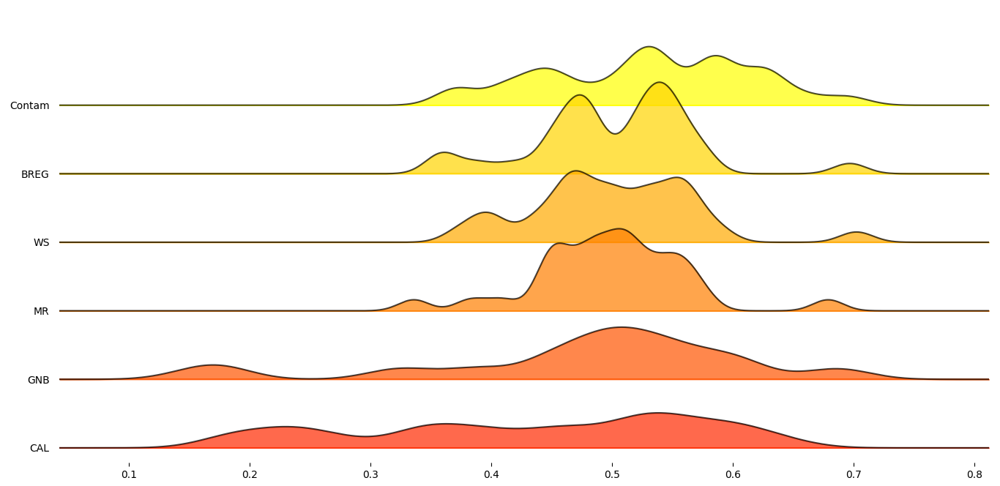
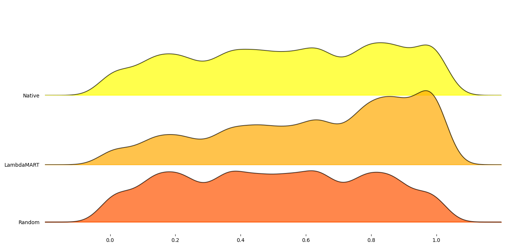
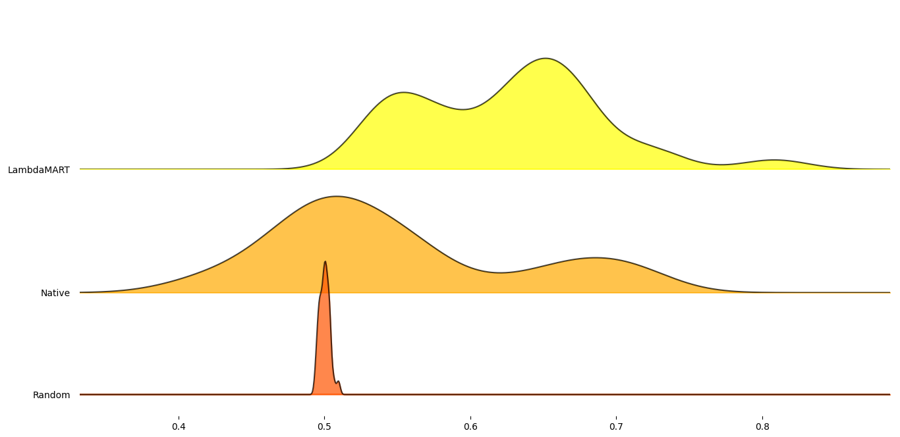
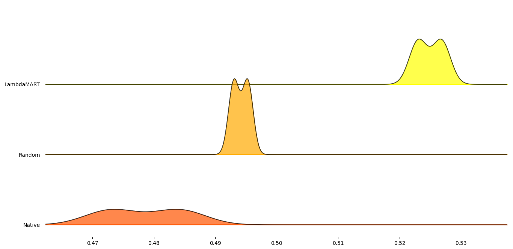

#########
 Ranking
#########

**************
 Introduction
**************

Outlier detection for unsupervised tasks is difficult. The difficulty
arises with how to evaluate whether the selected methods for outlier
detection and thresholding are correct or the best for the dataset.
Often, additional post-evaluation involves visual or domain knowledge
based decisions to make a final call. This process can be tedious and is
often just as complex as the methods used to do the outlier detection in
the first place.

However, there are some robust statistical methods that can be used to
indicate or at least provide a guide of which outlier detection and
thresholding methods perform better than others. This process is that of
a ranking problem and can be used to list in order the evaluated outlier
detection and thresholding methods in terms of their respective
performance with other methods.

----

In order to rank the multiple outlier detection and thresholding
methods' capabilities of effectively labeling a given dataset, it is
important to note what is defined by "capabilities". In this case, this
refers to how well the predicted labels solved by the outlier detection
and thresholding method compares to the true labels. This can be done
using the F1 score or Matthews correlation coefficient (MCC). But, since
unsupervised tasks means there is lack of true labels, the best option
is to use other robust statistical metrics that have a strong
correlation to the above mentioned scores.

To find these proxy-metrics a good starting point is to know what data
can be used to compute them. In the case of unsupervised outlier
detection, there are essentially three main components: the exploratory
variables (X), the predicted outlier likelihood scores, and the
thresholded binary labels. With these, criteria can be set to apply
proxy-metrics that can then be ranked to provide a list of best to worst
performing outlier detection and thresholding methods with respect to
these metrics.

***************
 Proxy-Metrics
***************

Different types of proxy-metrics can be used with respect to the F1 and
MCC. Below four catagories have been defined.

Clustering Based
================

Since the dataset is considered to contain outliers, a clear distinction
should exist between the inliers and outliers. By using clustering based
metrics, the measure of similarity or distance between centroids or each
datapoints can provide a single score of outlier detection method's to
effectively distinguish inliers from outliers. This should also indicate
greater distinction between the inlier and outlier clusters. For these
clustering based metrics the quality of the labeled data will be
evaluated using either the exploratory variables or the outlier
likelihood scores and their assigned labels `Automatic Selection of
Outlier Detection Techniques
<https://pure.tue.nl/ws/portalfiles/portal/109406381/CSE663_Vishal_Chouksey_31_aug.pdf>`_

Statistical Distances
=====================

Statistical distances quantify the measure of distances between
probability based measures. These distances can be used to compute a
single value difference between two probability distributions. This
hints to what data from the unsupervised outlier detection method task
should be used. Two distinct probability distributions can be computed
for the outlier likelihood scores with respected to their labeled class.

Curve Based
===========

Curve based method like clustering based methods can be used to compare
the performance of unsupervised anomaly detection algorithms. This is
done by leveraging the density of OD likelihood scores and evaluating
their distributions with particular interest on their tails as this is
typically where the outlier will lie `How to Evaluate the Quality of
Unsupervised Anomaly Detection Algorithms?
<https://arxiv.org/abs/1607.01152>`_

Consensus Based
===============

Since the other proxy-metrics evaluate each outlier detection method
individually, consensus based proxy-metrics rather compare the OD
methods against one another. This is done be creating a consensus
baseline by using all the OD method's results and comparing the
deviation of each OD method from this baseline. This allows for a
consensus based score to be assigned to each OD method with respect to
the other tested OD methods `A Large-scale Study on Unsupervised Outlier
Model Selection: Do Internal Strategies Suffice?
<https://arxiv.org/abs/2104.01422>`_ `Consensus outlier detection in
survival analysis using the rank product test
<https://www.biorxiv.org/content/10.1101/421917v1.full>`_

*********************************
 Proxy-Metrics Correlation Tests
*********************************

35 proxy-metrics scores were correlated against the true versus the
thresholded labels MCC score by applying Pearson's correlation. This was
done for all passing possible combinations of the ``PyOD`` outlier
detection methods ``LODA, QMCD, MCD, GMM, KNN, KDE, PCA, COPOD, HBOS,``
and ``IForest`` on the AD benchmark datasets: ``annthyroid, breastw,
cardio, Cardiotocography, fault, glass, Hepatitis, Ionosphere, landsat,
letter, Lymphography, mnist, musk, optdigits, PageBlocks, pendigits,
Pima, satellite, satimage-2, SpamBase, Stamps, thyroid, vertebral,
vowels, Waveform, WBC, WDBC, Wilt, wine, WPBC,`` and ``yeast`` available
at `ADBench dataset
<https://github.com/Minqi824/ADBench/tree/main/adbench/datasets/Classical>`_
and applying the ``FILTER, CLF, DSN, OCSVM, KARCH, HIST,`` and ``META``
thresholders. A total of 198357 possible passing (dropped error fits,
nans, and infs) combinations were tested for this evaluation. Tabulated
below is a meta-analysis of the proxy-metrics Pearson's score statistics
calculated for all the combination across the datasets.

For clustering based between the exploratory variables and the predicted
labels, the following proxy-metrics were tested.

-  CAL: Calinski-Harabasz
-  DAV: Davies-Bouldin score
-  SIL: Silhouette score

For clustering based between the outlier likelihood scores and the
predicted labels, the following proxy-metrics were tested.

-  BH: Ball-Hall Index
-  BR: Banfeld-Raftery
-  CAL_sc: Calinski-Harabasz score
-  DAV_sc: Davies-Bouldin score
-  DR: Det Ratio Index Dunn: Dunn's index
-  Hubert: Hubert index
-  Iind: Local Moran's I index
-  MR: Mclain Rao Index
-  PB: Point biserial Index
-  RL: Ratkowsky Lance Index
-  RT: Ray-Turi Index
-  SIL_sc: Silhouette score
-  SDBW: S_Dbw validity index
-  SS: Scott-Symons Index
-  WG: Wemmert-Gancarski Index
-  XBS: Xie-Beni index

For statistical distances, the following proxy-metrics were tested.

-  AMA: Amari distance
-  BHT: Bhattacharyya distance
-  BREG: Exponential Euclidean Bregman distance
-  COR: Correlation distance
-  ENG: Energy distance
-  JS: Jensen-Shannon distance
-  MAH: Mahalanobis distance
-  LK: Lukaszyk-Karmowski metric for normal distributions
-  WS: Wasserstein or Earth Movers distance

For curve based, the following proxy-metrics were tested.

-  EM: Excess-Mass curves
-  MV: Mass-Volume curves

For consensus based, the following proxy-metrics were tested.

-  Contam: Mean contamination deviation based on TruncatedSVD decomposed
   scores
-  GNB: Gaussian Naive-Bayes trained consensus score
-  HITS: Deviation from the HITS consensus authority based labels
-  Mode: Deviation from the mode of the predicted labels
-  Thresh: Label deviation from the TruncatedSVD decomposed thresholded
   labels

+---------------+----------------------------+----------------------------+----------------------------+
| Label         | Mean                       | Median                     | Standard Deviation         |
+===============+============================+============================+============================+
| CAL           | 0.1872                     | 0.2027                     | 0.4303                     |
+---------------+----------------------------+----------------------------+----------------------------+
| DAV           | -0.1257                    | -0.0474                    | 0.4523                     |
+---------------+----------------------------+----------------------------+----------------------------+
| SIL           | 0.1262                     | 0.0589                     | 0.4744                     |
+---------------+----------------------------+----------------------------+----------------------------+
| BH            | 0.0039                     | 0.0391                     | 0.4836                     |
+---------------+----------------------------+----------------------------+----------------------------+
| BR            | 0.0260                     | 0.0300                     | 0.4750                     |
+---------------+----------------------------+----------------------------+----------------------------+
| CAL_sc        | 0.0158                     | 0.0111                     | 0.5083                     |
+---------------+----------------------------+----------------------------+----------------------------+
| DAV_sc        | -0.0483                    | -0.0944                    | 0.5230                     |
+---------------+----------------------------+----------------------------+----------------------------+
| DR            | -0.0157                    | -0.0111                    | 0.5084                     |
+---------------+----------------------------+----------------------------+----------------------------+
| Dunn          | 0.0270                     | 0.0207                     | 0.5353                     |
+---------------+----------------------------+----------------------------+----------------------------+
| Hubert        | 0.0641                     | 0.1632                     | 0.4674                     |
+---------------+----------------------------+----------------------------+----------------------------+
| Iind          | 0.0648                     | 0.1527                     | 0.4763                     |
+---------------+----------------------------+----------------------------+----------------------------+
| MR            | 0.0789                     | 0.1710                     | 0.4973                     |
+---------------+----------------------------+----------------------------+----------------------------+
| PB            | 0.0367                     | 0.0715                     | 0.5089                     |
+---------------+----------------------------+----------------------------+----------------------------+
| RL            | -0.0314                    | -0.0569                    | 0.5081                     |
+---------------+----------------------------+----------------------------+----------------------------+
| RT            | -0.0034                    | 0.0524                     | 0.4884                     |
+---------------+----------------------------+----------------------------+----------------------------+
| SIL_sc        | 0.0473                     | 0.0801                     | 0.4885                     |
+---------------+----------------------------+----------------------------+----------------------------+
| SDBW          | -0.0641                    | -0.0627                    | 0.4736                     |
+---------------+----------------------------+----------------------------+----------------------------+
| SS            | -0.0034                    | 0.0524                     | 0.4884                     |
+---------------+----------------------------+----------------------------+----------------------------+
| WG            | -0.0244                    | -0.0210                    | 0.5221                     |
+---------------+----------------------------+----------------------------+----------------------------+
| XBS           | -0.0535                    | 0.0032                     | 0.5280                     |
+---------------+----------------------------+----------------------------+----------------------------+
| AMA           | 0.0543                     | 0.0088                     | 0.5046                     |
+---------------+----------------------------+----------------------------+----------------------------+
| BHT           | 0.0239                     | 0.0163                     | 0.5050                     |
+---------------+----------------------------+----------------------------+----------------------------+
| BREG          | 0.1022                     | 0.1546                     | 0.5006                     |
+---------------+----------------------------+----------------------------+----------------------------+
| COR           | 0.0173                     | 0.0364                     | 0.5114                     |
+---------------+----------------------------+----------------------------+----------------------------+
| ENG           | 0.1120                     | 0.1054                     | 0.5030                     |
+---------------+----------------------------+----------------------------+----------------------------+
| JS            | 0.0566                     | 0.1282                     | 0.5045                     |
+---------------+----------------------------+----------------------------+----------------------------+
| MAH           | 0.0749                     | 0.0300                     | 0.5075                     |
+---------------+----------------------------+----------------------------+----------------------------+
| LK            | 0.0749                     | 0.1048                     | 0.5070                     |
+---------------+----------------------------+----------------------------+----------------------------+
| WS            | 0.1133                     | 0.1766                     | 0.5001                     |
+---------------+----------------------------+----------------------------+----------------------------+
| EM            | 0.0261                     | 0.0752                     | 0.4332                     |
+---------------+----------------------------+----------------------------+----------------------------+
| MV            | 0.0094                     | -0.0164                    | 0.4361                     |
+---------------+----------------------------+----------------------------+----------------------------+
| Contam        | -0.2003                    | -0.1498                    | 0.5297                     |
+---------------+----------------------------+----------------------------+----------------------------+
| GNB           | -0.1931                    | -0.2902                    | 0.4768                     |
+---------------+----------------------------+----------------------------+----------------------------+
| HITS          | -0.0449                    | -0.1235                    | 0.5998                     |
+---------------+----------------------------+----------------------------+----------------------------+
| Mode          | -0.1505                    | -0.0840                    | 0.5377                     |
+---------------+----------------------------+----------------------------+----------------------------+
| Thresh        | -0.1696                    | -0.1940                    | 0.6031                     |
+---------------+----------------------------+----------------------------+----------------------------+

From the table above it can be seen that most proxy-metrics performed
sub-optimally. However, there were six proxy-metrics that performed
generally better than the others. These are the six proxy-metrics

-  The Calinski-Harabasz score
-  The Mclain Rao Index
-  The Exponential Euclidean Bregman distance
-  The Wasserstein distance
-  The mean contamination deviation based on TruncatedSVD decomposed
   scores
-  The Gaussian Naive-Bayes trained consensus score

In order to get a better understanding on how these six proxy-metrics
performed overall, joyplots below demonstrate the distributions of their
Pearson's correlation with respect to the MCC scores for each statistic.

   Figure 1: Total average Pearson's score of selected proxy metrics.

   Figure 2: Mean Pearson's score across datasets for selected proxy metrics.

   Figure 3: Median Pearson's score across datasets for selected proxy metrics.

   Figure 4: Standard deviation Pearson's score across datasets for selected proxy metrics.

*****************
 Rank OD Methods
*****************

The ranking process involves ordering the proxy-metric scores with
respect to their performance. The proxy-metrics are ordered
highest-to-lowest or lowest-to-highest based on their performance
criterion. The proxy-metrics are combined as follows: the statistical
based distances are combined using equal weighting on their ordered
ranks to compute a single ranked list. The same method is applied to the
clustering based, and consensus based metrics. Finally, an overall
combined rank is computed using the combined statistical based ranking,
the combined clustering based ranking, and the combined consensus based
ranking. This final combined ranking can either be computed using equal
weightings for each three combined rankings or a weight list can be
parsed based on preference.

The ``RANK`` method in ``PyThresh`` applies the method above to rank the
performance of the outlier detection and thresholding methods against
each other.

To evaluate the performance of ``RANK`` the ranking evaluation measure
was employed as described in `RankDCG: Rank-Ordering Evaluation Measure
<https://arxiv.org/abs/1803.00719>`_ and GitHub implementation `ranking
<https://github.com/dkaterenchuk/ranking_measures>`_

The ``RANK`` method was tested on the same dataset and OD and
thresholding methods as was used for the selected proxy-metrics.
Additionally, a fine-tuned LambdaMART model using XGBoost was also
trained on the selected proxy-metrics and ranks from the same dataset
with which to further evaluate the ``RANK`` performance. Also a random
ordered selection rank method was tested with which to compare the
RankDCG results to.

The joyplots below indicate the performance between the methods with
respect aggregation across each dataset.

   Figure 5: RankDCG scores for each tested combination.

   Figure 6: Mean RankDCG scores for each tested combination agregated per dataset.

As can be seen, the ``RANK`` method performed on average better than
random selection. However, the trained LambdaMART model achieved
significantly better scores than ``RANK``. To test that the model was
not overfitted and is able to generalize, the datasets ``mammography,
skin``, and ``smtp`` were tested as the model had not been trained on
them.

   Figure 7: Mean RankDCG scores for each tested combination aggregated per test dataset.

On these datasets the ``RANK`` method performed worse than random
selection. However, the trained LambdaMART model performed marginally
better than random selection. The lower performance of the model may be
due to the proxy-metrics' lower than training datasets correlation to
the MCC as well as the OD and thresholding methods performing poorly in
general on these dataset. This is reiterated as seen by the ``RANK``
method's performance. However, the model is still valid with respect to
its ability to rank OD and thresholding problems.

*********
 Example
*********

Below is a simple example of how to apply the ``RANK`` method:

.. code:: python

   # Import libraries
   from pyod.models.knn import KNN
   from pyod.models.iforest import IForest
   from pyod.models.pca import PCA
   from pyod.models.mcd import MCD
   from pyod.models.qmcd import QMCD
   from pythresh.thresholds.filter import FILTER
   from pythresh.utils.ranking import RANK

   # Initialize models
   clfs = [KNN(), IForest(), PCA(), MCD(), QMCD()]
   thres = FILTER() # or list of thresholder methods

   # Get rankings
   ranker = RANK(clfs, thres)
   rankings = ranker.eval(X)

*************
 Final Notes
*************

While the ``RANK`` method is a useful tool to assist in selecting the
possible best outlier detection and thresholding method to use, it is
not infallible. The use of the trained LambdaMART model will be used by
default however the standard ``RANK`` method can also be employed. It
has been noted from the tests above, that in general the ranked results
tended to return the best-to-worst performing outlier detection and
thresholding methods in the correct order. However, they were not
perfect. They at times exhibited incorrect orders and often the best
performing OD and thresholding method was in the top three rather than
being the top of the list. Additionally, some times well performing OD
and thresholding methods was ranked poorly.

Future work will test to see how effective this method is with regards
to other ranking OD and thresholding methods as well as how much better
it performs than simply picking the ``IForest`` OD method.

Note that this method is under active development and the model and
methods will be updated or upgraded in the future

The ``RANK`` method should be used with discretion but hopefully provide
more clarity on which OD and thresholding method to select.
